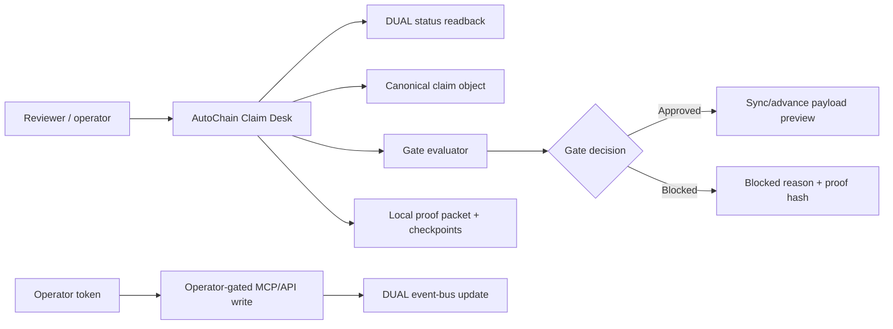

# AutoChain Demo Playbook

Live app: <https://autochain-eight.vercel.app/>

This playbook explains the AutoChain demo as a presenter would run it: what to click, what the audience should notice, and what DUAL is proving at each point. It supports a 5-7 minute walkthrough, a 90-second reviewer pass, and a technical follow-up.

## Executive Summary

AutoChain shows an OEM warranty claim moving through a DUAL-backed control desk. A dealer submits a claim for a Bosch 48V inverter module. The app checks serial validity, VIN/part binding, warranty coverage, duplicate-claim risk, dealer authority, evidence completeness, and payment readiness before state can advance.

The key message is simple:

> AutoChain turns a warranty claim from a workflow row into a verifiable DUAL-backed state object.

The demo is not about real payment execution. It is about claim-state governance, evidence checks, proof hashes, and a clear public/operator write boundary.

## Demo Assets

| Asset | Path |
| --- | --- |
| Live app | <https://autochain-eight.vercel.app/> |
| README | `README.md` |
| Deployment notes | `DEPLOYMENT.md` |
| MCP operator runbook | `docs/autochain-mcp-runbook.md` |
| Proof run sheet | `docs/autochain-proof-run-sheet.md` |
| Optional Kraken proof boundary | `docs/cross-demo-proof.md` |

## Demo Thesis

AutoChain demonstrates a DUAL pattern for high-trust warranty operations:

- A canonical claim object.
- A DVIN-style vehicle identity anchor.
- A state machine with explicit gates.
- A vehicle record timeline and evidence vault.
- A transparent vehicle trust score.
- Evidence refs and deterministic proof hashes.
- Readback from DUAL when configured.
- A shareable public verifier route.
- Local proof replay for public reviewers.
- Operator-gated write tools for controlled state changes.
- A visible public safety boundary.

The demo uses synthetic dealer and vehicle details. The DUAL object id, readback, proof hashes, MCP tools, and operator gate are the review surface.

## Who This Demo Is For

| Audience | What they should take away |
| --- | --- |
| Warranty operators | Claim decisions can be gated by evidence and policy instead of email/manual handoff. |
| OEM networks | Dealer reimbursements can be linked to serial, VIN, coverage, and duplicate-claim proof. |
| DUAL product team | DUAL can act as a state/proof layer for operational workflows, not just a token surface. |
| Developers | The public app and MCP surface can read/evaluate safely while writes remain operator-gated. |
| Enterprise buyers | The claim path becomes auditable, explainable, and reviewable without exposing private credentials. |

## Current State To Say Up Front

Presenter line:

> "This is a synthetic warranty claim with a real DUAL-backed proof/readback boundary. Public users can inspect and evaluate the claim. Only an operator can write to DUAL."

Current canonical claim:

| Field | Value |
| --- | --- |
| Claim id | `AC-OEM-2026-0007` |
| State | `Approved` in the current public production readback |
| Next gate | `Mark paid` / `paid` |
| DUAL org | `69b935b4187e903f826bbe71` |
| Template | `6a16d6a64754b22af1f6cdb0` |
| Claim object | `6a16d6a84754b22af1f6cdb2` |
| Public writes | `false` |

If the live state changes after an operator-gated test, refresh the table from `/api/claims/current` before presenting.

## System Map



What this means:

- The app reads a canonical claim.
- The evaluator checks the next gate.
- Public users can preview payloads and export proof.
- Operators can sync or advance only with a server-side DUAL key and `DEMO_OPERATOR_TOKEN`.
- The public surface stays read-only.

## Recommended Timing

| Segment | Time | Purpose |
| --- | ---: | --- |
| Open and frame | 30 sec | Establish synthetic claim, live DUAL proof, no public writes. |
| Claim context | 60 sec | Show queue, claim facts, and evidence completeness. |
| Gate chain | 90 sec | Show the state machine and next gate. |
| Proof rail | 90 sec | Show DUAL readiness, proof history, hashes, and support panel. |
| Payment control | 60 sec | Show why payment is gated by approved state and proof readiness. |
| MCP/operator boundary | 60 sec | Explain read-only MCP and operator-gated writes. |
| Close | 30 sec | Tie back to verifiable claim operations. |

Total: roughly 5-6 minutes.

## 90-Second Version

1. Open <https://autochain-eight.vercel.app/>.
2. Point to the official DUAL logo, `DUAL readback ready`, and `publicWrites=false`.
3. Read the disclosure: synthetic claim, live DUAL proof.
4. Point to the canonical claim `AC-OEM-2026-0007`.
5. Click `Reviewer Mode` to jump to the proof rail.
6. Show `Vehicle identity`, `Vehicle trust score`, `Vehicle record timeline`, and `Evidence vault`.
7. Click `Replay proof`.
8. Show `DUAL readiness`, `Proof history`, and `Demo support`.
9. Click `Export proof`.
10. Close with: "The claim desk can be inspected publicly, but state changes remain operator-gated."

## 1. Open The App

Start at the live app. Point out the first-viewport signals:

- Official DUAL logo.
- `AutoChain Claim Desk`.
- Canonical claim metadata.
- `DUAL readback ready` or local proof status.
- `publicWrites=false`.
- Demo disclosure and reviewer walkthrough.

Presenter line:

> "This is not a generic warranty dashboard. It is a claim state machine with DUAL proof and a visible write boundary."

## 2. Explain The Claim

The claim represents a dealer reimbursement request for a Bosch 48V inverter module.

Call out:

- Dealer: `North Shore Autohaus`.
- Claim id: `AC-OEM-2026-0007`.
- Part serial and replacement serial.
- Warranty mileage and expiry.
- Approved amount, deductible, and claim amount.
- Evidence refs for repair order, OEM serial signature, diagnostic scan, and installation photo.

What this proves:

- The claim is not just a payment request.
- It carries enough structured evidence to evaluate policy.
- The object can be hashed and re-derived.

## 3. Walk The Gate Chain

State machine:

```text
Claimed -> Part_Verified -> Coverage_Checked -> Approved -> Paid
```

Gate meanings:

| Gate | What it checks |
| --- | --- |
| `part_verified` | OEM signature, part serial, VIN binding, and recall status. |
| `coverage_checked` | Mileage, warranty date, dealer authority, duplicate claim, and coverage. |
| `approved` | Reimbursement approval and decision hash. |
| `paid` | Payment-release recording against the approved claim. |

Presenter line:

> "Every state change has a reason. The app does not just jump from claim submitted to paid."

What not to over-claim:

- The demo does not release real funds.
- The demo does not store raw repair evidence in the repo.
- Public users cannot advance the DUAL claim.

## 4. Show The Proof Rail

Click `Reviewer Mode` or scroll to the right rail.

Call out:

- `DUAL readiness`: runtime, mode, write mode, readback, public writes.
- `Proof history`: replayable proof checkpoints.
- `Support`: live demo URL, MCP runbook, API checks, and safety boundary.
- Exported proof packet: local JSON packet generated in-browser with no DUAL write.

Presenter line:

> "This is the trust receipt for the claim. It shows what was checked, what state the claim is in, and whether the app is reading from DUAL."

## 4A. Show The Vehicle Record Layer

Use the center panel before or after the proof rail.

Call out:

- `Vehicle identity`: a DVIN-style identifier derived from VIN, OEM, part serial, dealer, and DUAL object.
- `Vehicle trust score`: a transparent score across identity, serial, coverage, mileage, dealer authority, duplicate status, and evidence completeness.
- `Vehicle record timeline`: identity registration, mileage reading, service/replacement event, and warranty claim event.
- `Evidence vault`: hash-only references for repair order, OEM signature, diagnostic scan, and installation image.

Presenter line:

> "CarrChain frames the whole automotive record. AutoChain is narrower: it builds the vehicle record evidence needed to prove a warranty claim."

## 5. Show Payment Control

The payment panel is intentionally not a public execution surface.

Explain:

- Payment release is allowed only after the claim reaches `Approved`.
- The `Paid` gate records payment readiness and reference state.
- Public UI actions do not execute payment.
- Operator-gated writes are separate from public review.

Presenter line:

> "Payment is represented as controlled state, not a button anyone can press."

## 6. Explain The MCP Boundary

Use this if technical reviewers ask about agents.

Public MCP tools can:

- read status;
- read the current claim;
- evaluate the next gate;
- prepare sync and mint payload previews.

Operator MCP tools can:

- sync the claim;
- advance the gate;
- mint a claim object.

Operator tools require:

- server-side `DUAL_API_KEY`;
- `DUAL_WRITE_MODE=event_bus`;
- configured template/object ids;
- positive IanTest balance;
- `DEMO_OPERATOR_TOKEN`.

Presenter line:

> "Agents can inspect and evaluate the claim publicly. Mutation stays behind an operator gate."

## 7. Run A Red-Team Explanation

The easiest red-team story is conceptual: show what would block a transition.

Blocked examples:

| Scenario | Expected result |
| --- | --- |
| Duplicate claim | Coverage gate blocks reimbursement. |
| Invalid OEM signature | Part verification blocks the claim. |
| Mileage above warranty limit | Coverage gate blocks approval. |
| Dealer not authorized | Coverage gate blocks approval. |
| Payment before approval | Payment gate blocks release. |

Presenter line:

> "The blocked path matters as much as the approved path. It proves the claim is constrained by policy, not just displayed in a nice UI."

## 8. Objection Handling

| Question | Answer |
| --- | --- |
| Is this real customer data? | No. Dealer, vehicle, and evidence details are synthetic demo data. |
| Is it really connected to DUAL? | Production can read the canonical DUAL claim object and reports `DUAL readback ready` when configured. Use `/api/claims/current` and `/api/dual/status` to verify. |
| Can a public user write to DUAL? | No. Public writes are false. Sync, mint, and advance require an operator token plus server-side DUAL readiness. |
| Why is Kraken mentioned in the repo? | Kraken is optional cross-demo interoperability. AutoChain's default proof path is standalone and does not call Kraken. |
| Does it release real payment? | No. The payment step records claim state only; no real funds move. |
| What is DUAL adding? | DUAL provides the object/state/proof layer and a controlled boundary between public inspection and operator mutation. |
| Is this trying to be CarrChain? | No. CarrChain is a broad automotive records blockchain. AutoChain is a focused DUAL-backed claim verification and vehicle-record proof layer. |

## Troubleshooting During A Live Demo

| Symptom | What to do |
| --- | --- |
| DUAL status shows local proof | Continue the demo as a local proof walkthrough; do not claim live readback. |
| Current state is not `Approved` | Read `/api/claims/current` and narrate the actual next gate. |
| Export proof does not download | Use `Copy brief` and `/api/claims/current` as fallback evidence. |
| MCP call fails | Use the browser UI and mention that MCP is an agent interface over the same read/evaluate path. |
| Someone asks for a live write | State that live writes are operator-gated and require explicit approval. |

## Close The Demo

Close with:

> "AutoChain shows how DUAL can make operational workflows inspectable: a claim, evidence, policy gates, proof hashes, readback, and a write boundary."

Short close:

> "The value is not just claim automation. It is claim automation with proof."

## Presenter Checklist

- Open the live app.
- Confirm official DUAL logo is visible.
- Confirm `publicWrites=false`.
- Confirm DUAL readiness status.
- Show canonical claim `AC-OEM-2026-0007`.
- Show DVIN-style vehicle identity and trust score.
- Show vehicle timeline and evidence vault.
- Show state and next gate.
- Click `Reviewer Mode`.
- Click `Replay proof`.
- Export the proof packet.
- Explain public read/evaluate versus operator-gated write.
- Avoid claiming real payment, live customer evidence, or anonymous writes.

## Post-Demo Follow-Up

Send these points after the demo:

- Live demo URL: <https://autochain-eight.vercel.app/>
- Public demo is read/evaluate/proof export only.
- Canonical DUAL object: `6a16d6a84754b22af1f6cdb2`.
- Template: `6a16d6a64754b22af1f6cdb0`.
- MCP endpoint: `https://autochain-eight.vercel.app/mcp`.
- Operator write testing requires explicit approval and server-side credentials.

## One-Page Recap

AutoChain is a DUAL-backed warranty claim desk. It takes one canonical claim, checks it against a clear state machine, binds it to evidence refs and hashes, and exposes a public proof surface. The browser and public MCP path can inspect and evaluate the claim; they cannot write to DUAL. Operator-gated paths can sync, advance, or mint only when server-side DUAL readiness and an operator token are present.

The reusable pattern is claim object plus state gates plus proof packet plus operator boundary. That pattern can apply to warranty, insurance, pharma custody, trade finance, and any workflow where the state change matters more than the UI button.
